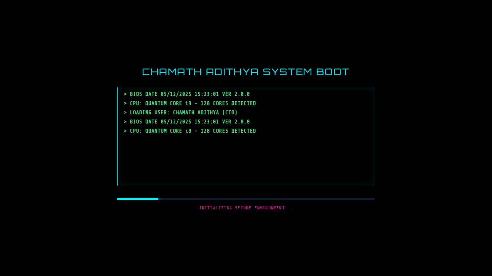

# Interactive Sci-Fi OS Portfolio




A futuristic, operating system-themed portfolio website built with HTML, Tailwind CSS, and Three.js. This project showcases an interactive desktop environment with window management, a terminal, and a 3D background.

## Features

- **OS Interface**: Desktop environment with icons, taskbar, and start menu.
- **Window Management**: Draggable, minimizable, and closable windows.
- **Terminal**: Interactive shell with custom commands (e.g., `help`, `projects`, `skills`).
- **3D Background**: Starfield animation using Three.js.
- **Responsive Design**: Adapts to mobile and desktop screens.
- **Themes**: Cyberpunk/Sci-Fi aesthetic with CRT and scanline effects.
- **Audio System**: Sound effects for interactions (with mute toggle).

## Technologies

- **HTML5**
- **Tailwind CSS** (via CDN)
- **Three.js** (via CDN)
- **Font Awesome** (for icons)
- **Google Fonts** (Orbitron, Share Tech Mono, Rajdhani)

## Getting Started

Simply open `index.html` in your web browser. No build process or server is required as it uses CDN links for dependencies.

```bash
# Clone the repository
git clone https://github.com/Chamath-Adithya/interactive-os-portfolio.git

# Navigate to the directory
cd interactive-os-portfolio

# Open index.html in your browser
# (On macOS)
open index.html
# (On Linux)
xdg-open index.html
# (On Windows)
start index.html
```

## Project Structure

```
.
├── index.html          # Main entry point (HTML structure)
├── style.css           # Custom styles (animations, scrollbars)
├── script.js           # Core logic (window management, terminal, audio)
├── screenshots/        # Project screenshots
├── verification/       # Automated verification scripts (Python/Playwright)
├── LICENSE             # MIT License
└── README.md           # Project documentation
```

## Customization

You can customize the content by editing the HTML directly:
- **Profile**: Edit the content inside the `#about-window`.
- **Projects**: Update the project cards in `#projects-window`.
- **Skills**: Modify the skill bars in `#skills-window`.
- **Terminal**: Add or change commands in the `processCommand` function in the `<script>` section.

## Verification

The project includes automated tests using Python and Playwright to verify functionality and SEO.

```bash
# Install dependencies
pip install playwright
playwright install chromium

# Run verification tests
python verification/test_features.py
python verification/verify_seo_final.py
```

## License

This project is open source and available under the [MIT License](LICENSE).
